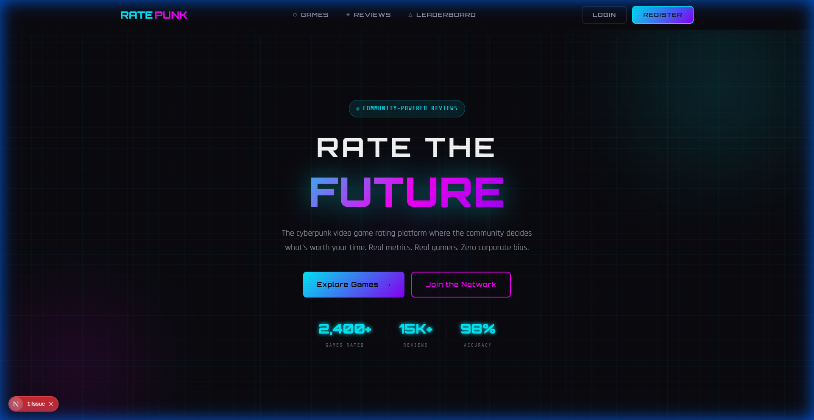
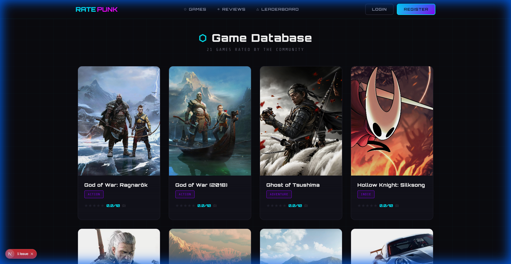
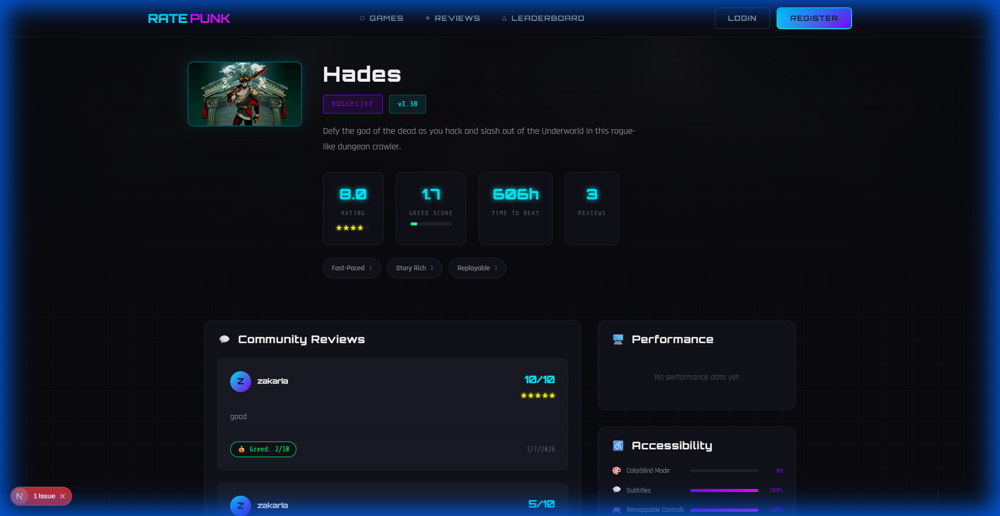
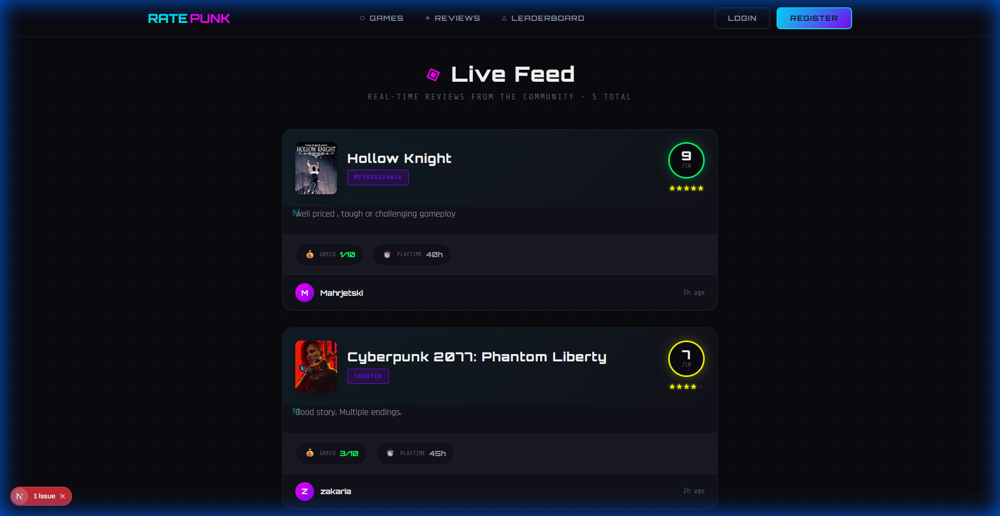
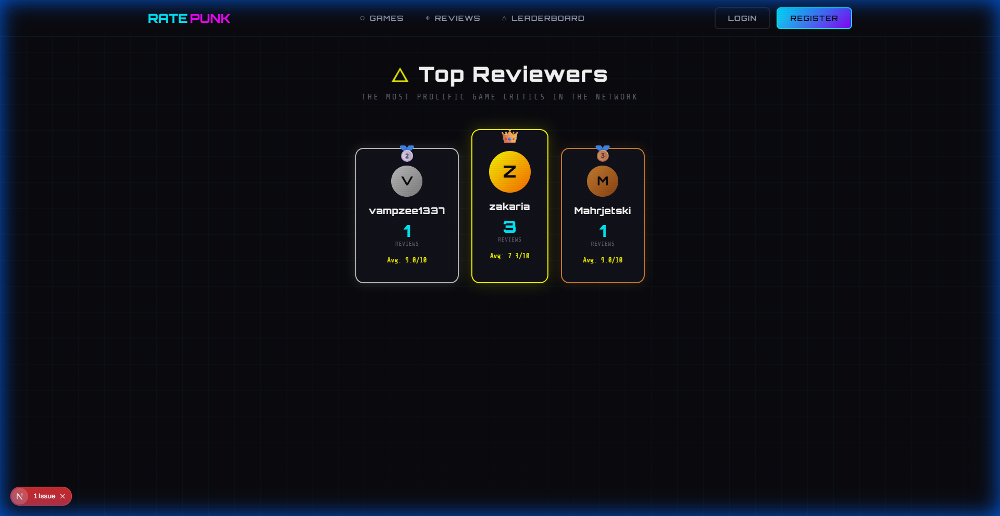

# 🎮 RatePunk

> A cyberpunk-themed video game rating platform with crowdsourced metrics



## ✨ Features

### 💰 Greed Score
Rate how aggressive a game's monetization is (1-10). Track microtransactions, DLC practices, and pay-to-win elements.

### 🖥️ Performance Reports
Submit and view GPU/CPU benchmarks from real users. Compare FPS across different hardware configurations.

### ♿ Accessibility Wiki
Community-voted accessibility features - colorblind modes, subtitles, remappable controls, and more.

### 🔄 Patch-Aware Reviews
Reviews tagged by game version. See which feedback applies to the current build vs. outdated patches.

### 📊 Live Review Feed
Real-time stream of community reviews with eye-catching card design.

### 🏆 Leaderboard
Top reviewers ranked by contribution count with podium display.

### 🔍 RAWG API Integration
Import games from RAWG's database of 500,000+ titles with one click.

---

## 📸 Screenshots

<details>
<summary>View All Screenshots</summary>

### Games Library


### Game Detail Page


### Live Reviews Feed


### Leaderboard


</details>

---

## 🛠️ Tech Stack

| Category | Technology |
|----------|------------|
| **Framework** | Next.js 16 (App Router) |
| **Language** | TypeScript |
| **Database** | PostgreSQL (Neon) |
| **ORM** | Prisma |
| **Auth** | NextAuth.js v5 |
| **Styling** | CSS Modules |
| **Deployment** | Vercel |
| **External API** | RAWG.io |

---

## 🚀 Getting Started

### Prerequisites
- Node.js 18+
- npm or yarn
- PostgreSQL database (or use [Neon](https://neon.tech) for free)

### Installation

```bash
# Clone the repository
git clone https://github.com/shaanzeeeee/rate-punk.git
cd rate-punk

# Install dependencies
npm install

# Set up environment variables
cp env.template .env
# Edit .env with your database URL, auth secret, and RAWG API key

# Push database schema
npx prisma db push

# Seed sample data
npx tsx prisma/seed.ts

# Start development server
npm run dev
```

Open [http://localhost:3000](http://localhost:3000) to view the app.

---

## ⚙️ Environment Variables

| Variable | Description |
|----------|-------------|
| `DATABASE_URL` | PostgreSQL connection string |
| `AUTH_SECRET` | Random secret for NextAuth.js |
| `AUTH_URL` | Your app URL (http://localhost:3000 for dev) |
| `RAWG_API_KEY` | API key from [rawg.io/apidocs](https://rawg.io/apidocs) |

---

## 📁 Project Structure

```
src/
├── app/
│   ├── api/           # API routes
│   ├── games/         # Game listing & detail pages
│   ├── reviews/       # Live review feed
│   ├── leaderboard/   # Top reviewers
│   ├── profile/       # User profile
│   ├── login/         # Authentication
│   └── register/
├── components/        # Reusable UI components
├── lib/               # Prisma client & auth config
└── types/             # TypeScript definitions
```

---

## 🎨 Design System

Custom cyberpunk aesthetic featuring:
- **Color Palette**: Neon cyan, magenta, purple, yellow
- **Fonts**: Orbitron, Rajdhani, Share Tech Mono
- **Effects**: Glassmorphism, neon glows, glitch animations
- **Dark Mode**: Full dark theme with grid overlay

---

## 📝 License

MIT License - feel free to use this project for learning or as a portfolio piece.

---

## 🤝 Contributing

Contributions are welcome! Feel free to open issues or submit pull requests.

---

<p align="center">
  Built with 💜 using Next.js & Prisma
</p>
